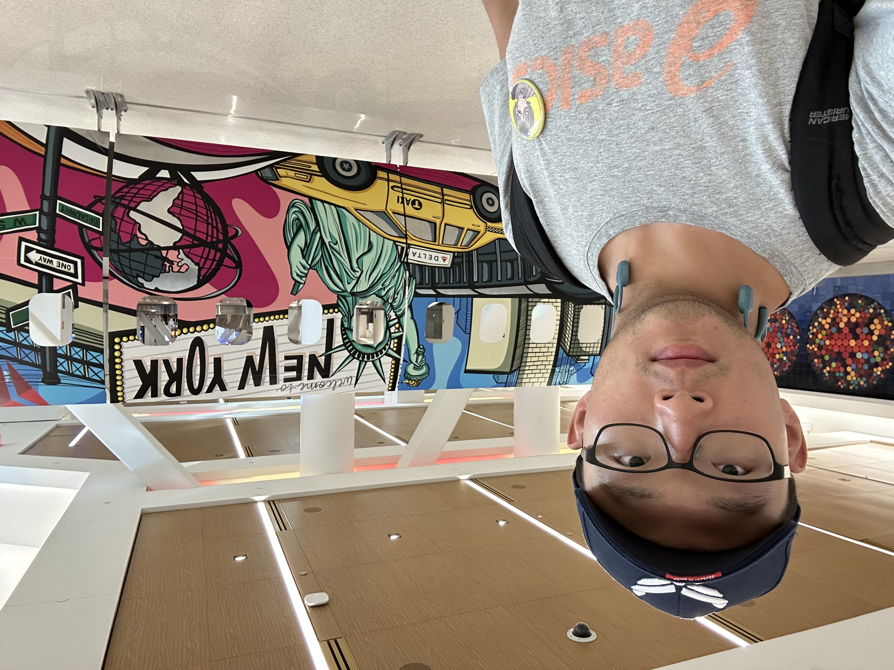

| [home page](https://cmustudent.github.io/tswd-portfolio-templates/) | [data viz examples](dataviz-examples) | [critique by design](critique-by-design) | [final project I](final-project-part-one) | [final project II](final-project-part-two) | [final project III](final-project-part-three) |

# Portfolio
This is my public portfolio for the Telling Stories with Data (94830) course. It is used for introducint myself, setting goals for myself, as well as storing data visualization projects.

# About me
Hi! I'm Chongdi Wang, a master's student in the Information Systems Management--Business Intelligence and Data Analytics (MISM-BIDA) program in Carnegie Mellon's Heinz College. As someone fond of listening to stories (both fictional and in real-life) and a student whose major is related to data, I find the course "Telling Stories With Data" quite intriguing, and I believe it will uncover connections between data and storytelling that will be helpful for my work. So here I am, creating this portfolio for my future projects in Tellling Stories With Data!

Outside of work and study, I do a lot of cardio exercise daily. I'm not a big fan of any particular artist, but I listen to a lot of pop rock music, both Asian and American. By the way, whenever I have more than 2 days of spare time, I'll be travelling to somewhere--I hope that I could visualize where I've been over the years by the end of this course!

# What I hope to learn
The following are the top three things that I hope to obtain through this course: 

1. Ways of designing clean, easy-to-read graphics that tell the data I want to tell;
2. IT tools that help me design fancy data visualization;
3. Ways of criticizing data visualization and telling stories from them.

# Links for Assignments and Projects

## Assignment: [Visualizing government Debt](dataviz-examples.md)

## Assignment 3&4: [Critique by Design](critique-by-design.md)

## Final project

- [Part I](final-project-part-one.md)
- [Part II](final-project-part-two.md)
- [Part III](final-project-part-three.md)

# AI acknowledgements
ChatGPT 5 has been used in the above projects and assignments to help navigate through tools including Shorthand and Tableau.
